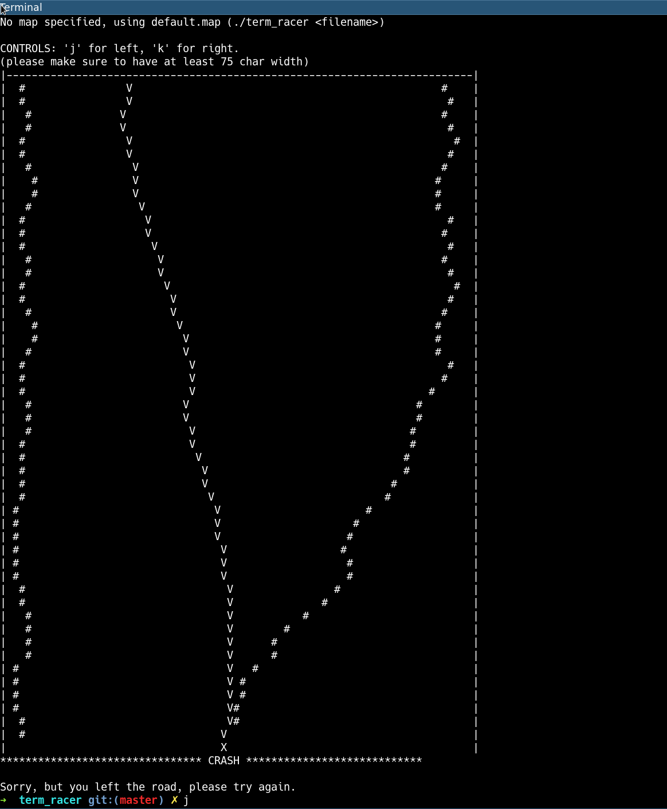

term_racer
==========

_Something I did 2004 and felt like uploading it now as sort of backup. Surely this is not clean code but probably we all produced stuff like that at some point._

A simple game to experiment with setting terminal options and using select or pthreads to achieve the same thing.

Requirements
------------

 - Linux

Building
--------

    make

Versions
--------

- ``term_*``
    - Ensure constant input and output by using ``select``
    - Version ``*_simple`` does not take the wait time into
      account and goes faster if there is more input. Is is actually the original version, I later created the constant "fps" fix.
 - ``thread_*``
    - Uses threads to handle input and output processing

term_racer / thread_racer
-------------------------

A small console game, where you have to try staying on the given track.

term_editor / thread_editor
---------------------------

The tool to create new tracks for the game.
Usage: term_editor <filename.map>
(overwrites old one)

Screenshot
----------

